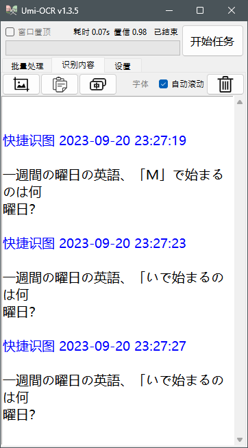
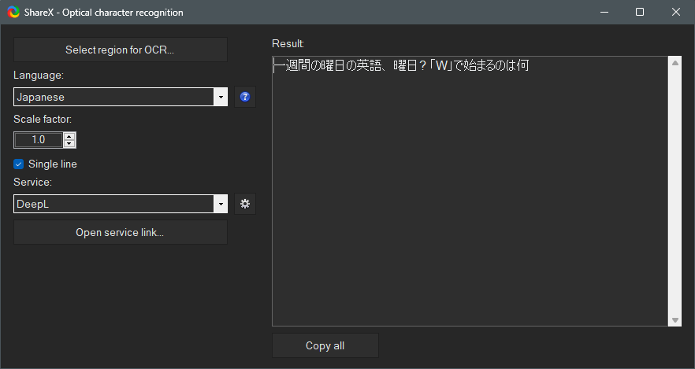

# Princess Connect ! Re:Dive Academy Quiz Solver

Read the original README.md [Here](/README_ORI.md)

## Highlights of Changes

1. Added support for multiple OCR engines (accessible by running `run.[OCR Engine].py`).
   - Available OCR engines include EasyOCR (using pyTorch GPU/CPU), WinRT OCR Engine, with PaddleOCR as the default.
2. Implemented failsafe and warning alerts through sound cues when OCR reads specific `asm_id` values, prompting manual intervention for clicking.
3. Improved question detection accuracy using WinRT OCR, although it may be slower compared to PaddleOCR.
4. Optimized image preprocessing before feeding it into the OCR reader, especially in the cropped answer region.
5. Informs the user whether OCR successfully found the answer or not. If there are three possible answers but OCR can confidently identify only two, it will alert the user to manually click the last option and submit the answer.

## Why Use WinRT OCR (Microsoft)?

WinRT OCR (Microsoft) is chosen because it excels at recognizing single characters enclosed in brackets, such as `「W」`. Other OCR engines like PaddleOCR and EasyOCR may struggle to recognize such characters, leading to incorrect answers when used for question queries.

Here's an example to illustrate the issue:

### Umi-OCR powered by Paddle-OCR result

### Share-X result using WinRT OCR

Even when using EasyOCR in PyTorch GPU mode, it may fail to detect these characters correctly. However, WinRT OCR can accurately recognize such questions. Therefore, the current solution involves using a combination of OCR engines: WinRT OCR for questions and PaddleOCR for answer boxes.

Additional notes: I'm not using the `winocr` pip package because I think the package is broken on Python 3.11. Instead, I'm using this [WinRT OcrEngine from Python](https://gist.github.com/dantmnf/23f060278585d6243ffd9b0c538beab2) (thanks, mate). Also, avoid using the EasyOCR engine as it is the slowest OCR engine and requires a CUDA-supported GPU to reduce processing time (it took about 3 seconds on my 3070Ti, but results were still inaccurate).